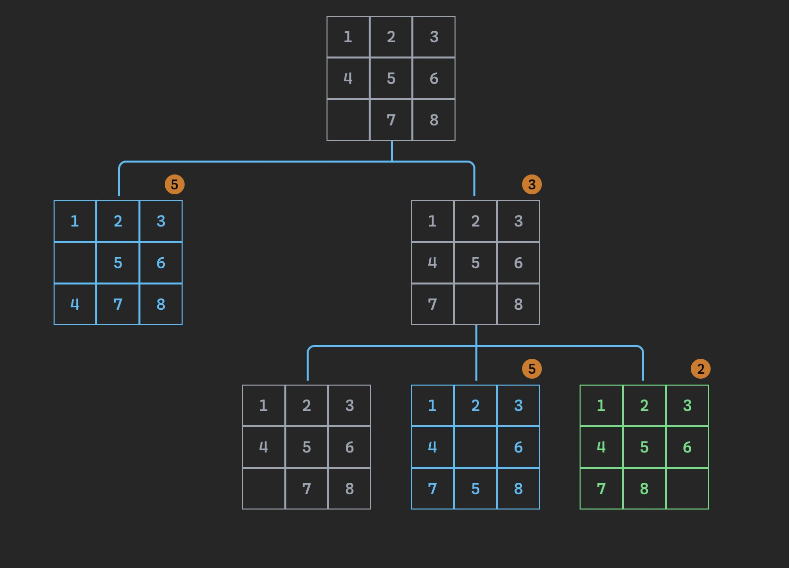

# heuristic-search made with elm

This project demonstrates the use of the [heuristic](https://en.wikipedia.org/wiki/Heuristic_(computer_science)) to find the shortest path between two points on a grid.

The example used here is an 8 puzzle game, where the goal is to move the tiles to the correct position.

The heuristic used is the [Manhattan distance](https://en.wikipedia.org/wiki/Taxicab_geometry), which is the sum of the distances of the tiles to their correct positions.

> f = g + h

where:
* g = the distance from the starting point to the current point
* h = the number of tiles that are not in their correct position

## Example:



> 🌳  built with [elm-spa](https://elm-spa.dev)

## dependencies

This project requires the latest LTS version of [Node.js](https://nodejs.org/)

```bash
npm install -g elm elm-spa
```

## running locally

```bash
elm-spa server  # starts this app at http:/localhost:1234
```

### other commands

```bash
elm-spa add    # add a new page to the application
elm-spa build  # production build
elm-spa watch  # runs build as you code (without the server)
```

## learn more

You can learn more at [elm-spa.dev](https://elm-spa.dev)